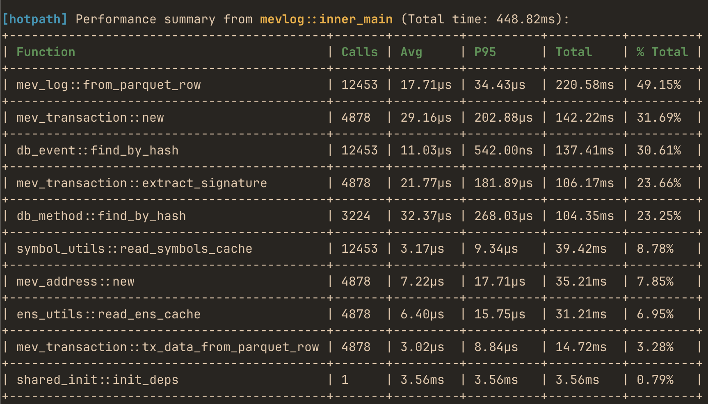
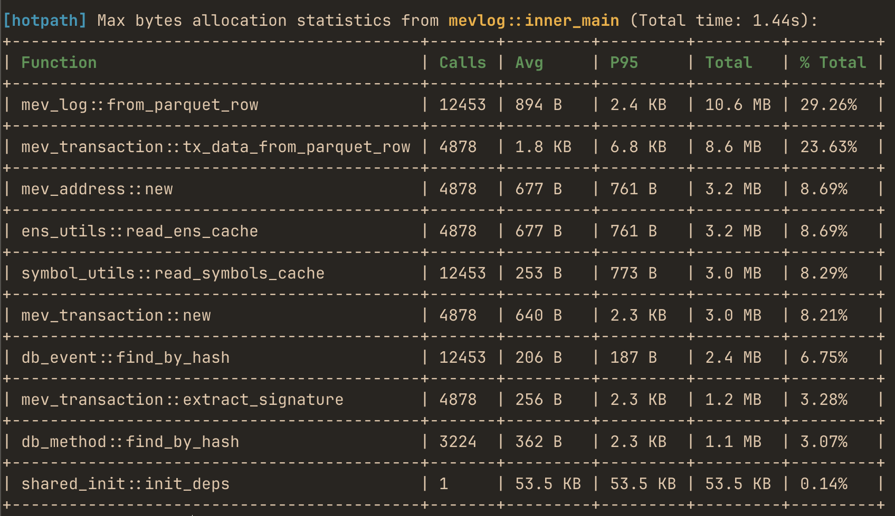

# hotpath - find and profile bottlenecks in Rust
[](https://crates.io/crates/hotpath) [](https://github.com/pawurb/hotpath/actions)

[](https://github.com/pawurb/mevlog-rs)

A lightweight, easy-to-configure Rust profiler that shows exactly where your code spends time and allocates memory. Instrument any function or code block to quickly spot bottlenecks, and focus your optimizations where they matter most.

## Features

- **Zero-cost when disabled** — fully gated by a feature flag.
- **Low-overhead** profiling for both sync and async code.
- **Memory allocation tracking** — track bytes allocated or allocation counts per function.
- **Detailed stats**: avg, total time, call count, % of total runtime, and configurable percentiles (p95, p99, etc.).
- **Background processing** for minimal profiling impact.

## Quick Start

Add to your `Cargo.toml`:

```toml
[dependencies]
hotpath = { version = "0.2", optional = true }

[features]
hotpath = ["dep:hotpath", "hotpath/hotpath"]
hotpath-alloc-bytes-total = ["hotpath/hotpath-alloc-bytes-total"]
hotpath-alloc-bytes-max = ["hotpath/hotpath-alloc-bytes-max"]
hotpath-alloc-count-total= ["hotpath/hotpath-alloc-count-total"]
hotpath-alloc-count-max= ["hotpath/hotpath-alloc-count-max"]
```

This config ensures that the lib has **zero** overhead unless explicitly enabled via a `hotpath` feature.

## Usage

```rust
use std::time::Duration;

#[cfg_attr(feature = "hotpath", hotpath::measure)]
fn sync_function(sleep: u64) {
    std::thread::sleep(Duration::from_nanos(sleep));
}

#[cfg_attr(feature = "hotpath", hotpath::measure)]
async fn async_function(sleep: u64) {
    tokio::time::sleep(Duration::from_nanos(sleep)).await;
}

// When using with tokio, place the #[tokio::main] first
#[tokio::main]
// You can configure any percentile between 0 and 100
#[cfg_attr(feature = "hotpath", hotpath::main(percentiles = [99]))]
async fn main() {
    for i in 0..100 {
        // Measured functions will automatically send metrics
        sync_function(i);
        async_function(i * 2).await;

        // Measure code blocks with static labels
        #[cfg(feature = "hotpath")]
        hotpath::measure_block!("custom_block", {
            std::thread::sleep(Duration::from_nanos(i * 3))
        });
    }
}
```

Run your program with a `hotpath` feature:

```
cargo run --features=hotpath
```

Output:

```
[hotpath] Performance summary from basic::main (Total time: 122.13ms):
+-----------------------+-------+---------+---------+----------+---------+
| Function              | Calls | Avg     | P99     | Total    | % Total |
+-----------------------+-------+---------+---------+----------+---------+
| basic::async_function | 100   | 1.16ms  | 1.20ms  | 116.03ms | 95.01%  |
+-----------------------+-------+---------+---------+----------+---------+
| custom_block          | 100   | 17.09µs | 39.55µs | 1.71ms   | 1.40%   |
+-----------------------+-------+---------+---------+----------+---------+
| basic::sync_function  | 100   | 16.99µs | 35.42µs | 1.70ms   | 1.39%   |
+-----------------------+-------+---------+---------+----------+---------+
```

## Allocation Tracking

In addition to time-based profiling, `hotpath` can track memory allocations. This feature uses a custom global allocator from [allocation-counter crate](https://github.com/fornwall/allocation-counter) to intercept all memory allocations and provides detailed statistics about memory usage per function.

Available alloc profiling modes:

- `hotpath-alloc-bytes-total` - Tracks total bytes allocated during each function call
- `hotpath-alloc-bytes-max` - Tracks peak memory usage during each function call
- `hotpath-alloc-count-total` - Tracks total number of allocations per function call
- `hotpath-alloc-count-max` - Tracks peak number of live allocations per function call

Run your program with a selected flag to print a similar report:

```
cargo run --features='hotpath,hotpath-alloc-bytes-max'
```



### Profiling memory allocations for async functions

To profile memory usage of `async` functions you have to use a similar config:

```rust
#[cfg(any(
    feature = "hotpath-alloc-bytes-total",
    feature = "hotpath-alloc-bytes-max",
    feature = "hotpath-alloc-count-total",
    feature = "hotpath-alloc-count-max",
))]
#[tokio::main(flavor = "current_thread")]
async fn main() {
    _ = inner_main().await;
}

#[cfg(not(any(
    feature = "hotpath-alloc-bytes-total",
    feature = "hotpath-alloc-bytes-max",
    feature = "hotpath-alloc-count-total",
    feature = "hotpath-alloc-count-max",
)))]
#[tokio::main]
async fn main() {
    _ = inner_main().await;
}

#[cfg_attr(feature = "hotpath", hotpath::main)]
async fn inner_main() {
    // ...
}
```

It ensures that tokio runs in a `current_thread` runtime mode if any of the allocation profiling flags is enabled.

**Why this limitation exists**: The allocation tracking uses thread-local storage to track memory usage. In multi-threaded runtimes, async tasks can migrate between threads, making it impossible to accurately attribute allocations to specific function calls.

## How It Works

1. `#[cfg_attr(feature = "hotpath", hotpath::main)]` - Macro that initializes the background measurement processing
2. `#[cfg_attr(feature = "hotpath", hotpath::measure)]` - Macro that wraps functions with profiling code
3. **Background thread** - Measurements are sent to a dedicated worker thread via bounded channel
4. **Statistics aggregation** - Worker thread maintains running statistics for each function/code block
5. **Automatic reporting** - Performance summary displayed when the program exits

## API

`#[cfg_attr(feature = "hotpath", hotpath::main]`

Attribute macro that initializes the background measurement processing when applied to your main function. Can only be used once per program. 

`#[cfg_attr(feature = "hotpath", hotpath::measure)]`

An opt-in attribute macro that instruments functions to send timing measurements to the background processor.

`hotpath::measure_block!(label, expr)`

Macro that measures the execution time of a code block with a static string label.

### Percentiles Support

By default, `hotpath` displays P95 percentile in the performance summary. You can customize which percentiles to display using the `percentiles` parameter:

```rust
#[tokio::main]
#[cfg_attr(feature = "hotpath", hotpath::main(percentiles = [50, 75, 90, 95, 99]))]
async fn main() {
    // Your code here
}
```

For multiple measurements of the same function or code block, percentiles help identify performance distribution patterns. You can use percentile 0 to display min value and 100 to display max.

## Benchmarking

Measure overhead of profiling 1 million empty method calls with [hyperfine](https://github.com/sharkdp/hyperfine):

```
cargo build --example benchmark --features hotpath --release
hyperfine --warmup 3 './target/release/examples/benchmark'
```
