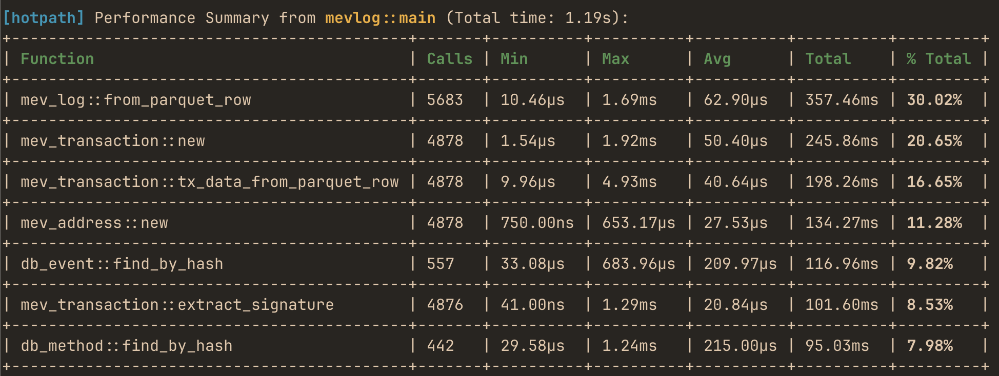

# hotpath - find and profile Rust bottlenecks
[](https://crates.io/crates/hotpath) [](https://github.com/pawurb/hotpath/actions)



A lightweight Rust performance profiling library with background processing and statistic aggregations. Instrument any function or code block to quickly find bottlenecks and profile calls with minimal overhead. See each label's share of total runtime to easily focus optimizations.

## Features

- **Opt-in / zero cost when disabled** (gate with a feature flag)
- **Zero-overhead profiling** for functions and code blocks (bounded queue + background thread)
- **Stats per label:** min, max, avg, total, calls, and % of total
- Works in both **sync** and **async** code

## Quick Start

Add to your `Cargo.toml`:

```toml
[dependencies]
hotpath = { version = "0.2", optional = true }

[features]
hotpath = ["dep:hotpath"]
```

## Usage

```rust
use std::time::Duration;

#[cfg_attr(feature = "hotpath", hotpath::measure)]
fn sync_function() {
    std::thread::sleep(Duration::from_millis(100));
}

#[cfg_attr(feature = "hotpath", hotpath::measure)]
async fn async_function() {
    tokio::time::sleep(Duration::from_millis(150)).await;
}

#[tokio::main]
async fn main() {
    // Prints report when _hotpath guard is dropped
    #[cfg(feature = "hotpath")]
    let _hotpath = hotpath::init!();

    // Measured functions will automatically send metrics
    sync_function();
    async_function().await;
    
    // Measure code blocks with static labels
    #[cfg(feature = "hotpath")]
    hotpath::measure_block!("sync_block", {
        std::thread::sleep(Duration::from_millis(100))
    });

    #[cfg(feature = "hotpath")]
    hotpath::measure_block!("async_block", {
        tokio::time::sleep(Duration::from_millis(150)).await;
    });
}
```

Run your program with a `hotpath` feature:

```
cargo run --features=hotpath
```

Output:
```
[hotpath] Performance Summary from basic::main (Total time: 512.97ms):
+-----------------------+-------+----------+----------+----------+----------+---------+
| Function              | Calls | Min      | Max      | Avg      | Total    | % Total |
+-----------------------+-------+----------+----------+----------+----------+---------+
| async_block           | 1     | 152.02ms | 152.02ms | 152.02ms | 152.02ms | 29.63%  |
+-----------------------+-------+----------+----------+----------+----------+---------+
| basic::async_function | 1     | 151.22ms | 151.22ms | 151.22ms | 151.22ms | 29.48%  |
+-----------------------+-------+----------+----------+----------+----------+---------+
| basic::sync_function  | 1     | 105.03ms | 105.03ms | 105.03ms | 105.03ms | 20.47%  |
+-----------------------+-------+----------+----------+----------+----------+---------+
| sync_block            | 1     | 104.38ms | 104.38ms | 104.38ms | 104.38ms | 20.35%  |
+-----------------------+-------+----------+----------+----------+----------+---------+
```

## How It Works

1. `#[cfg_attr(feature = "hotpath", hotpath::measure)]` - Proc-macro that wraps functions with timing code
2. **Background thread** - Measurements are sent to a dedicated worker thread via bounded channel
3. **Non-blocking** - Function execution continues immediately after sending measurement
4. **Statistics aggregation** - Worker thread maintains running statistics for each function/code block
5. **Seamless cleanup** - Performance summary displayed automatically when `_hotpath` guard is dropped

## API

`let _hotpath = hotpath::init!()`

Macro that initializes the background measurement processing thread. Returns a `_hotpath` guard that should be kept alive for the duration of measurements.

`hotpath::measure_block!(label, expr)`

Macro that measures the execution time of a code block with a static string label.

`#[cfg_attr(feature = "hotpath", hotpath::measure)]`

An opt-in attribute macro that instruments functions to send timing measurements to the background processor.
